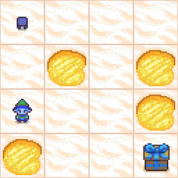

# AntEater

Anteater is a development tool for assisting in RL research for games with long range goals. Running agents takes a lot of time a data collection and it is nice to have tools to automate some of the repetitive tasks during development. Gives more time for you to focus on your research. Built around gynasium.

You can run the "FrozenLake" test in main to see an example of Temporal Difference Q Learning in action.

`python3 main.py --num-episodes=100 --render_mode=human --move-limit=30`

>Render mode on hum will slow your training down.
